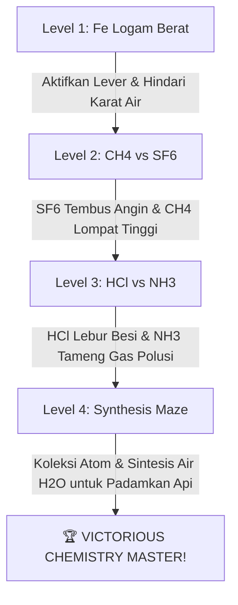

# 🧪 ChemWeave 3D — Panduan Sains Interaktif 🚀✨

Selamat datang di **ChemWeave 3D**! Platform edukasi kimia modern yang membawa teori **VSEPR (Valence Shell Electron Pair Repulsion)** keluar dari buku teks membosankan dan mengubahnya menjadi petualangan visual 3D yang interaktif, menyenangkan, dan super responsif! 🎓🔬

---

## 🗺️ Panduan Modul & Akses Fitur Per Halaman

Platform ini dirancang dengan navigasi yang sangat mulus. Berikut cara mengakses dan fitur unggulan di setiap halamannya:

### 🔬 1. 3D Visualizer & Periodic Builder (Halaman Utama)
> **Cara Akses**: Buka file [index.html](file:///Users/macbookpro/Documents/Jokian/vsepr-3d-explorer/index.html) di browser Anda.

*   **Fitur Unggulan**:
    *   ⚡ **Interactive Periodic Table**: Klik pada atom-atom di tabel periodik interaktif untuk menggunakannya sebagai atom pusat.
    *   💎 **Live 3D Render Engine (Three.js)**: Menampilkan visualisasi molekul secara real-time lengkap dengan atom pendamping dan Pasangan Elektron Bebas (PEB/Lone Pair) berupa awan transparan hijau neon.
    *   🔄 **Full Interactive Controls (Baru!)**: Seret mouse/jari untuk rotasi 3D bebas hambatan, serta gunakan scroll wheel/pinch gesture untuk memperbesar/memperkecil molekul secara instan.
    *   📊 **Hybrid Properties Sidebar**: Panel kanan yang menyajikan info rumus VSEPR (seperti $AX_2E_1$), sudut ikatan teoritis, kepolaran, hibridisasi, hingga contoh nyata di dunia medis/industri.

---

### 📚 2. Materi Pembelajaran Kimia (Halaman Materi)
> **Cara Akses**: Klik menu **Materi** pada navbar atas, atau buka langsung [materi/index.html](file:///Users/macbookpro/Documents/Jokian/vsepr-3d-explorer/materi/index.html).

*   **Fitur Unggulan**:
    *   🔍 **Smart Search & Filter**: Ketik nama molekul atau kategori materi (misal: *Gaya Spasial*) untuk menyaring kartu materi secara instan.
    *   ✏️ **Add Custom Materi Form**: Ingin menambah materi baru? Tambahkan melalui form interaktif di bagian bawah grid materi.
    *   💾 **Persistent Offline Storage (LocalStorage)**: Materi kimia baru yang Anda tambahkan **tidak akan hilang** meskipun browser ditutup atau laptop dimatikan! Data tersimpan aman di dalam browser perangkat Anda.

---

### 🏆 3. VSEPR Challenge (Halaman Kuis)
> **Cara Akses**: Klik menu **Quiz** pada navbar atas, atau buka langsung [quiz/index.html](file:///Users/macbookpro/Documents/Jokian/vsepr-3d-explorer/quiz/index.html).

*   **Fitur Unggulan**:
    *   ⚡ **Quizizz-Style Score Engine**: Kecepatan menjawab sangat menentukan! Makin cepat Anda memilih jawaban benar, bonus skor kecepatan (*Speed Bonus*) akan semakin tinggi.
    *   🔮 **Smart Dynamic 3D Viewer (Baru!)**: 
        *   Untuk soal struktur spasial (`3d`), molekul akan dirender dalam wujud 3D interaktif yang dapat Anda putar dan zoom untuk mencari jawaban.
        *   Untuk soal teori/konseptual (`concept`), kontainer 3D akan otomatis disembunyikan agar layout menjadi bersih, ringkas, dan fokus penuh pada teks pertanyaan.
    *   📊 **Mastery Summary Report**: Laporan akhir interaktif yang menunjukkan tingkat akurasi Anda dengan pesan motivasi khusus berdasarkan performa kuis.

---

### 🎮 4. Molecular Adventure (Halaman Game)
> **Cara Akses**: Klik menu **Game** pada navbar atas, atau buka langsung [game/index.html](file:///Users/macbookpro/Documents/Jokian/vsepr-3d-explorer/game/index.html).

*   **Fitur Unggulan**:
    *   🛠️ **Dua-Langkah Start Overlay (Baru!)**: Halaman pembuka super bersih yang menyajikan kolom nama, diikuti dengan modal panduan visual interaktif mengenai kontrol gerakan dan penalti kimia sebelum petualangan dimulai.
    *   🤖 **Custom Canvas Physics Engine**: Nikmati pergerakan stickman yang responsif berlari dan melompat di atas tebing batu, kayu, dan besi.
    *   📱 **Mobile Touch Overlay Controls**: Kontrol joystick virtual di layar HP yang otomatis muncul saat diakses menggunakan perangkat mobile.

---

## 🗼 Panduan Petualangan Game: Walkthrough Per Level

> [!IMPORTANT]
> **HUKUM KIMIA REAKTIF**: Di game ini, Anda mengontrol molekul aktif untuk melintasi rintangan. Menabrak rintangan dengan molekul yang salah akan langsung memicu **PENALTI** berupa pengurangan darah (HP) atau kematian instan akibat reaksi kimia tak terkendali!

---

### 🗼 Level 1: The Iron Tower (Bentuk Dasar Besi)
*   **Misi**: Memanjat menara batu dan kayu dengan tubuh berwujud **Besi (Fe)** untuk menarik tuas (*lever*) di dasar kanan bawah, lalu kembali ke puncak kiri untuk melewati gerbang keluar.
*   **Rintangan**: 
    *   💧 Genangan Air (**H₂O**): Sangat berbahaya! Besi (**Fe**) yang menyentuh air akan mengalami reaksi **Oksidasi (Karat)** pekat yang mengurangi HP Anda dengan cepat.
    *   🧱 Pilar Tembaga (**Cu**): Menghalangi jalan ke lantai atas.
*   **Strategi Pemenang**:
    1.  Lompati genangan air **H₂O** di lantai dasar dengan hati-hati. Wujud logam **Fe** memiliki gravitasi yang mantap untuk kontrol lompatan.
    2.  Berjalan ke ujung kanan bawah untuk mengaktifkan Tuas Sakelar Gerbang.
    3.  Pilar tembaga **Cu** di tangga akan otomatis terangkat. Naik ke atas menggunakan platform kayu, lalu lari menuju pintu exit di kanan atas!

---

### 💨 Level 2: The Chamber of Gases (Metana vs Sulfur Heksada)
*   **Misi**: Melewati terowongan badai angin badai raksasa dan menyeberangi jurang cairan asam yang mematikan.
*   **Persediaan Molekul (Inventory)**: **CH₄** (Metana - Bentuk Tetrahedral) & **SF₆** (Sulfur Heksada - Bentuk Oktahedral).
*   **Rintangan**:
    *   🌪️ Kipas Badai Angin Raksasa: Meniup paksa karakter Anda ke arah jurang asam.
    *   🧪 Jurang Cairan Asam Korosif (**ACID**).
*   **Strategi Pemenang**:
    1.  Tekan **`C`** untuk menukar wujud ke **SF₆**. Karena memiliki massa molekul relatif ($Mr$) yang sangat besar ($\approx 146$ g/mol), kepadatan gas **SF₆** yang tinggi membuat karakter Anda **sangat berat dan stabil** untuk berjalan menembus hembusan angin kipas badai tanpa terdorong ke jurang.
    2.  Setelah melewati tiupan angin, tekan **`C`** kembali untuk swap ke **CH₄**. Metana memiliki $Mr$ sangat ringan ($\approx 16$ g/mol) yang membuat tubuh Anda seringan kapas untuk melakukan **lompatan super tinggi** ke platform kayu di atas.
    3.  Lompat dengan presisi menuju pintu keluar!

---

### 🏭 Level 3: The Corrosive Factory (Asam Klorida vs Amonia)
*   **Misi**: Menyusuri pabrik kimia beracun dan menghancurkan pilar besi serta dinding batu kapur (**CaCO₃**) yang menyumbat jalur evakuasi.
*   **Persediaan Molekul (Inventory)**: **HCl** (Asam Klorida - Linear) & **NH₃** (Amonia - Trigonal Piramida).
*   **Rintangan**:
    *   ⚠️ Zona Basa Kuat (**NaOH**): Korosif ekstrem.
    *   🧱 Pilar Penghalang Besi (**Fe**) & Dinding Batu Kapur (**CaCO₃**).
    *   🌫️ Awan Kabut Gas **NOx** Beracun.
*   **Strategi Pemenang**:
    1.  Saat berada di lantai bawah, swap ke **HCl**. Berjalanlah menabrak pilar penghalang Besi (**Fe**) dan Batu Kapur (**CaCO₃**). Asam kuat **HCl** akan bereaksi secara korosif melelehkan Besi ($2HCl + Fe \rightarrow FeCl_2 + H_2$) dan menghancurkan batu kapur ($2HCl + CaCO_3 \rightarrow CaCl_2 + CO_2 + H_2O$) sehingga jalur terbuka bebas!
    2.  Naik ke tangga atas menggunakan platform kayu.
    3.  Sebelum melangkah masuk ke zona kabut asap merah **NOx**, swap ke **NH₃**. Tekan tombol **`E`** untuk melepaskan awan gas amonia penetralisir beracun yang bertindak sebagai **tameng pelindung**.
    4.  Berjalan dengan aman menembus kabut asap NOx dan keluar melalui pintu exit sebelah kiri bawah!

---

### 🧪 Level 4: The Synthesis Maze (Lab Sintesis Puncak)
*   **Misi**: Berwujud **Stickman biasa** tanpa kekuatan, kumpulkan atom-atom melayang bebas di udara untuk mensintesis molekul yang Anda butuhkan, lalu padamkan kobaran api berkobar demi meraih kemenangan akhir!
*   **Persediaan Molekul**: Kosong (Harus disintesis sendiri!).
*   **Rintangan**:
    *   🔥 Kobaran Api Membara (**FIRE**): Menghalangi jalan menuju pintu exit di puncak tengah.
*   **Strategi Pemenang**:
    1.  Jelajahi lab bawah dan lompat untuk mengoleksi atom-atom melayang:
        *   **Sintesis CH₄ (Kekuatan Lompat)**: Ambil **1 Atom C** + **4 Atom H**. Anda sekarang bisa terbang/lompat sangat tinggi!
        *   **Sintesis H₂O (Kekuatan Air)**: Ambil **2 Atom H** + **1 Atom O**.
    2.  *Tips*: Jika Anda tidak sengaja mengambil kombinasi atom yang salah, berjalanlah ke mesin **Trash Device** di pojok kanan bawah untuk membuang atom dan memulai ulang sintesis.
    3.  Setelah berhasil mensintesis **H₂O**, swap ke wujud air tersebut.
    4.  Lompat ke lantai puncak dan berjalanlah menabrak kobaran api **FIRE**. Wujud air **H₂O** akan memadamkan kobaran api secara instan tanpa melukai Anda!
    5.  Masuk ke gerbang exit tengah dan rayakan kemenangan mutlak Anda sebagai **Master Kimia Spasial**! 🏆

---

## ⌨️ Panduan Tombol Kontrol (Keyboard)

| Tombol | Fungsi Utama | Deskripsi Taktis |
| :---: | :--- | :--- |
| **`W`, `A`, `S`, `D`** / **`←`, `↑`, `↓`, `→`** | **Pergerakan Karakter** | Berlari ke kiri/kanan dan melompat melewati tebing. |
| **`C`** | **Swap Molecule Power** | Mengubah wujud molekul aktif sesuai persediaan di level tersebut. |
| **`E`** | **Aktivasi Kekuatan Khusus** | Melepas tameng gas (Level 3 - NH3) atau memicu aksi khusus. |
| **`Spacebar`** | **Instant Restart Run** | Mengulang kuis/perjalanan dari Level 1 dengan Timer 0 secara instan jika terjebak. |

---

## 🛠️ Arsitektur Teknologi Platform

Platform ini dibangun menggunakan teknologi web murni berkinerja tinggi tanpa ketergantungan framework berat:
*   **Three.js (WebGL)**: Menggerakkan visualisasi 3D rendering molekul dengan bayangan dinamis (*soft shadows*), material logam/plastik fisik (*PBR materials*), dan kontrol orbit spasial.
*   **HTML5 Canvas (2D)**: Menangani render game platformer 2D, kalkulasi deteksi tabrakan AABB (*Axis-Aligned Bounding Box*), sistem fisika gravitasi, dan partikel gas.
*   **Vanilla JS (ES6)**: Sistem kecerdasan logika kuis, modul kimia dasar terintegrasi, penanganan state visualizer, dan penyimpanan lokal data.
*   **CSS3 Custom Variables & Glassmorphic UI**: Memberikan visualisasi modern dengan latar belakang blur premium, gradasi pendaran neon, serta animasi transisi yang sangat memanjakan mata!

---

> *"Di dalam ruang mikro partikel atom, geometri molekul adalah kunci penentu sifat alam semesta. Selamat menjelajah, Kimiawan!"* 🧪✨
